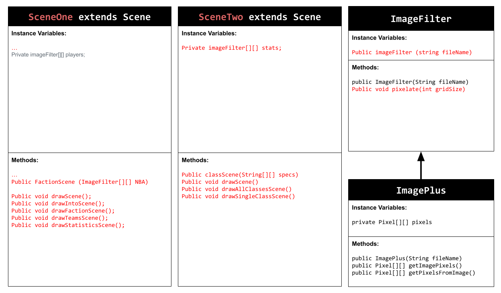

# Personal-Narrative-Project
This is my personal narrative project by Michael Kovler
# Unit 5 - Personal Narrative / Interest Animation

## Introduction

Images are often used to portray our personal experiences and interests. We also use image filters and effects to change or enhance the mood of an image. When combined into collages and presentations, these images tell a story about who we are and what is important to us. Your goal is to create an animation using The Theater and Scene API that consists of images of your personal experiences and/or interests. In this animation, you will incorporate data related to these experiences and/or interests that can be organized in a 2D array, and use image filters and effects to change or enhance the mood of your images.
## Requirements

Use your knowledge of object-oriented programming, two-dimensional (2D) arrays, and algorithms to create your personal narrative collage or animation:
- **Write Scene subclasses** – Create two Scene subclasses: either two core parts of your personal life, or two components of a personal interest. Each class must contain a constructor and private instance variable with data related to the scene
- **Create at least two 2D arrays** – Create at least two 2D arrays to store the data that will make up your visualization.
Implement algorithms – Implement one or more algorithms that use loops and logic that operate on the data in your 2D arrays.
- **Create a visualization** – Create an animation that conveys the story of the data by illustrating the patterns or relationships in the data.
- **Image Filters** – Utilize the image filters created in this unit (and possible new filters) that show a personal flare to the images used in your animation.
- **Document your code** – Use comments to explain the purpose of the methods and code segments and note any preconditions and postconditions.

## UML Diagram

## Video

## Story Description

My animation first presents the NBA Logo as my project is based on the NBA. First, the images in my SceneOne class are stored in a 2D array called players. To begin, the NBA Logo is shown and then horizontally mirrored which is a filter that I created on my own. I then show a set of images that show my favorite NBA playres currently and they all are changed using the applySepia filter. Lastly, in my SceneTwo class, my images are stored in a different 2D array called stats. The images shown each show a picture of my favorite playres with their stats in regards to points of their highest scoring game of their career. The image is then changed with the adjust contrast filter by a multiplier of 5. 

## Image Filter Analysis

A filter that I created that was not one of the ones from this unit was my mirrorHorizontal filter. This filter reflects an image across the horizontal axis. Next, another filter I used from this unit was the applySepia filter. This filter gives an image a warm, antique tone by shifting and altering the RGB values to balance them towards brown and golds. Lastly, another filter that I used from this unit was the adjustContrast method. This method changes the brightness so the difference in brightness between the lightest and darkest parts of an image becomes more visible. The higher the contrast the higher the difference of colors in an image. 